# AI Ticket Triage Bot

An automated support ticket classification pipeline that combines an LLM (Google Gemini) with a deterministic rule layer, exposed as both a web UI and an API, and connected to a live email trigger via n8n.

Built as a portfolio project to bridge existing RPA/automation experience (Blue Prism, Power Automate) with practical LLM API integration.

## What it does

- Reads a support ticket (single paste, CSV upload, or a real incoming email)
- Classifies it into a category (`Access Issue`, `Bug`, `How-To Question`, `Outage`, `Billing`, `Other`) and priority (`Low`/`Medium`/`High`) using Gemini with schema-constrained JSON output
- Applies a deterministic rule layer on top of the LLM output:
  - Keyword-based override (e.g. "outage", "down", "entire team") forces High priority regardless of model confidence
  - Low-confidence classifications are flagged for human review
- Automatically triggers on new incoming emails via a self-hosted n8n workflow (Gmail → API → mark as read)

## Architecture

```
Real email ──▶ Gmail Trigger (n8n) ──▶ HTTP Request (n8n) ──▶ Flask API ──▶ Gemini (schema-constrained) ──▶ Rule layer ──▶ Mark as read (n8n)
                                                                      ▲
Manual ticket / CSV upload ──▶ Streamlit UI ─────────────────────────┘
```

Both entry points (the live email trigger and the manual UI) share the exact same classification and rule logic, just through different interfaces.

## Why a rule layer on top of the LLM?

LLM self-reported confidence scores run consistently high and aren't well-calibrated as real probabilities. Rather than trust the model's judgment blindly for routing decisions, this project treats the LLM as a proposal and a small set of deterministic rules as the final say — similar in spirit to a Blue Prism decision layer sitting on top of an unreliable input source. This is the same "AI proposes, rules dispose" pattern used in production triage systems.

## Tech stack

- **LLM**: Google Gemini (`gemini-3.1-flash-lite`), schema-constrained JSON output
- **Backend**: Python, Flask (API), Pandas (batch processing)
- **Frontend**: Streamlit (manual single-ticket and CSV batch UI)
- **Automation**: n8n (self-hosted) — Gmail trigger, HTTP request, mark-as-read
- **Data**: CSV in/out

## Project structure

```
├── streamlit_app.py         # Streamlit UI — single ticket + CSV batch tabs
├── api.py                  # Flask API endpoint (POST /classify) — used by n8n
├── triage_batch.py         # Standalone CLI batch script over a CSV
├── sample_tickets.csv      # Example input data
├── classified_tickets.csv  # Example output
├── requirements.txt
├── .env.example
├── screenshots/            # Walkthrough screenshots (referenced below)
└── experiments/            # Early learning scripts (first API call, structured output)
    ├── test.py
    └── jsonop.py
```

## Setup

1. Clone the repo and install dependencies:
   ```
   pip install -r requirements.txt
   ```
2. Get a free Gemini API key at [Google AI Studio](https://aistudio.google.com)
3. Copy `.env.example` to `.env` and add your key:
   ```
   GOOGLE_API_KEY=your_key_here
   ```
4. Run the Streamlit app:
   ```
   streamlit run streamlit_app.py
   ```
   Or run the batch script directly:
   ```
   python triage_batch.py
   ```
   Or start the API (for n8n / external integration):
   ```
   python api.py
   ```

## Walkthrough

### 1. Calling the Gemini API
First working call to the Gemini API, plain text response.

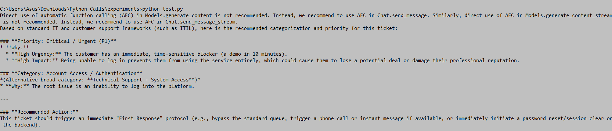

### 2. Structured, schema-constrained output
Instead of free text, the model is constrained to return valid JSON matching an exact category/priority schema — this is what makes the output usable by downstream automation.

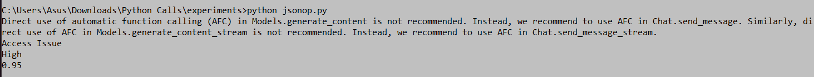

### 3. Batch processing
A Pandas loop classifies an entire CSV of tickets, with rate-limit-aware retry logic built in.

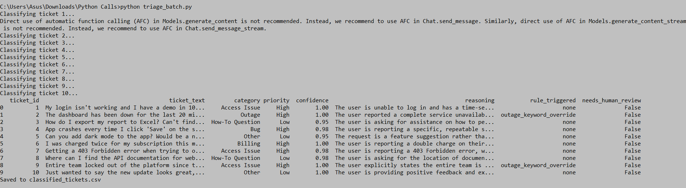
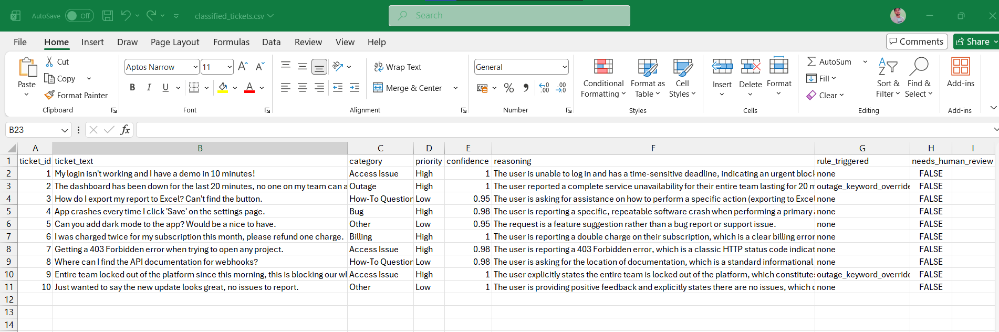

### 4. Deterministic rule layer
On top of the LLM output, keyword-based overrides and a low-confidence flag decide whether a ticket is safe to auto-route or needs a human. Notice `outage_keyword_override` firing on tickets mentioning outages/downtime, forcing High priority independent of the model's own judgment.

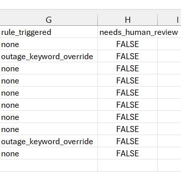

### 5. Streamlit UI
A simple web interface for classifying a single ticket, or an entire CSV batch with a progress bar and download button.

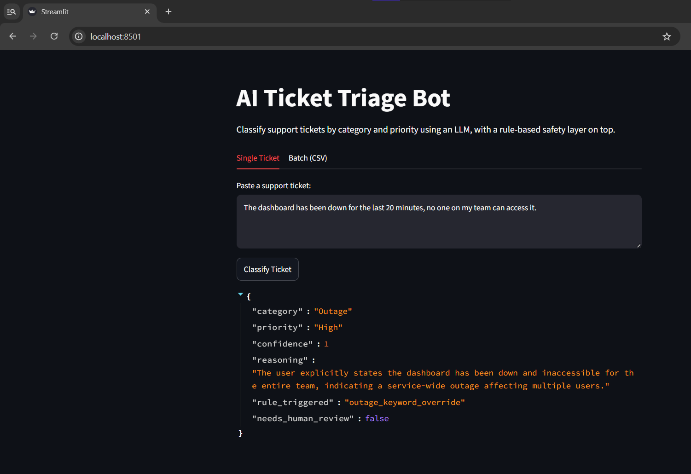
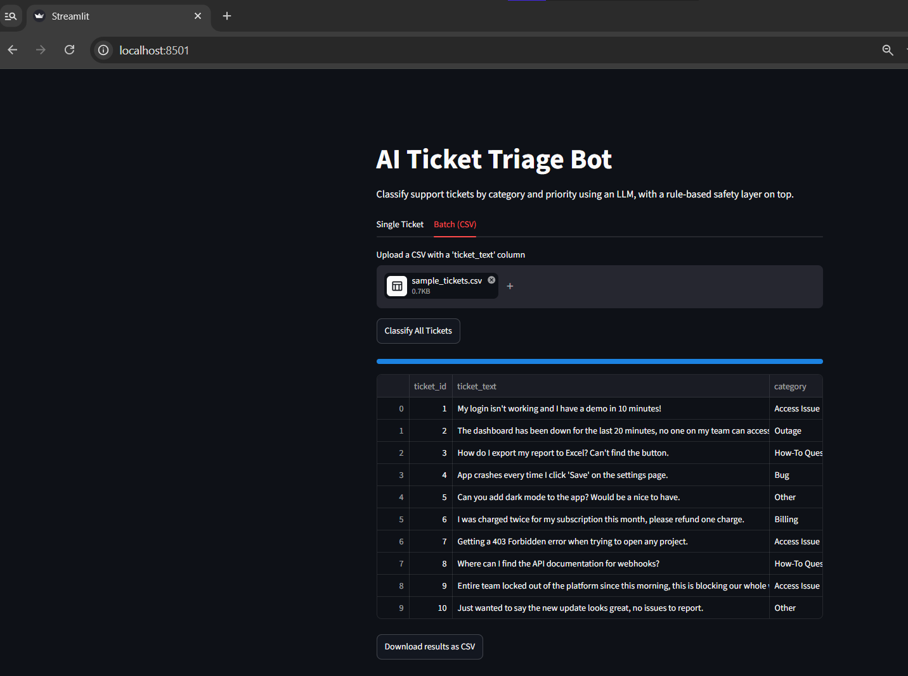

### 6. Flask API + n8n automation
The same classification logic exposed as an HTTP endpoint, callable by external tools.

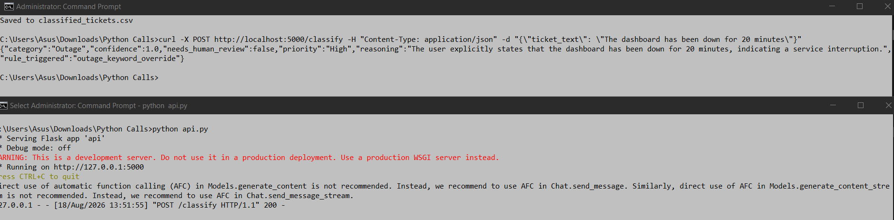

A self-hosted n8n workflow watches Gmail for new mail, sends it to the API, and marks the email as read once classified — a fully automated trigger, no manual input required.

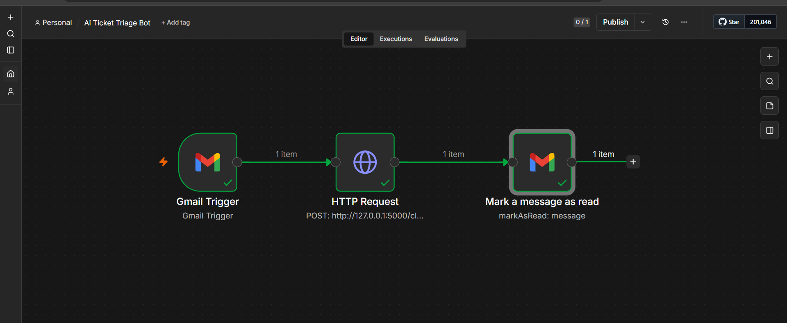
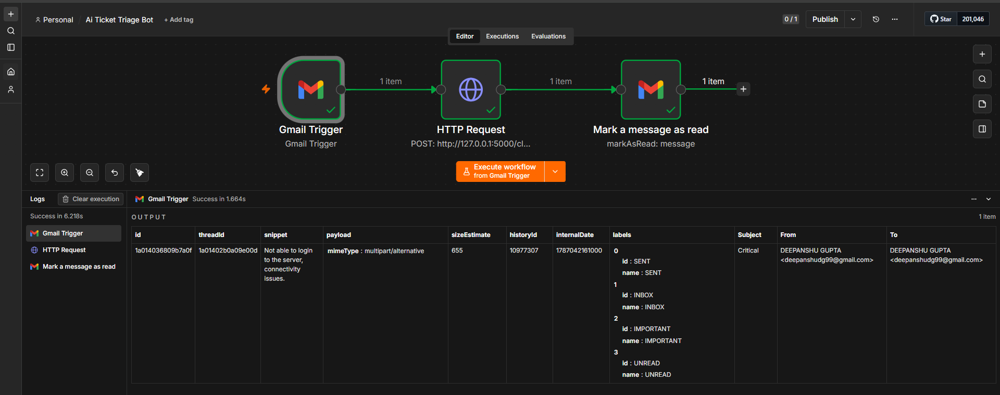
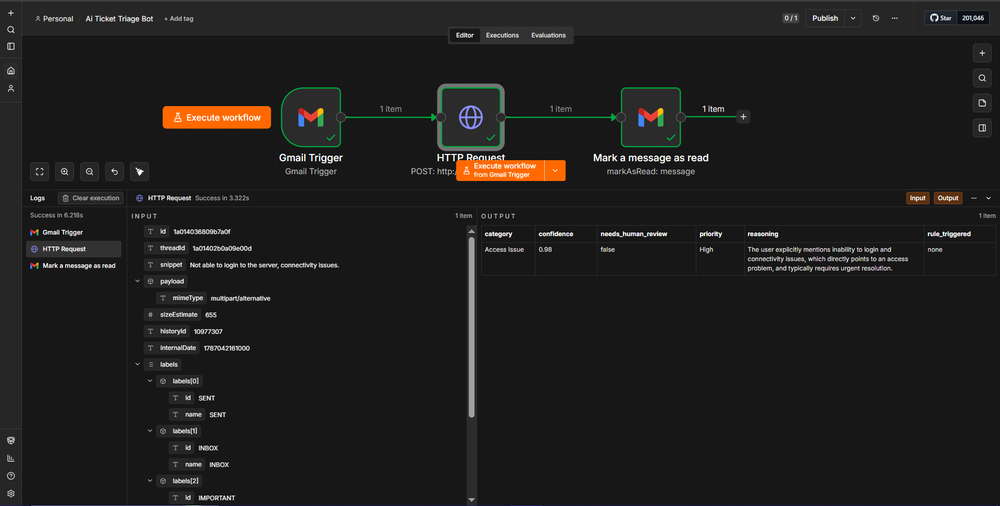
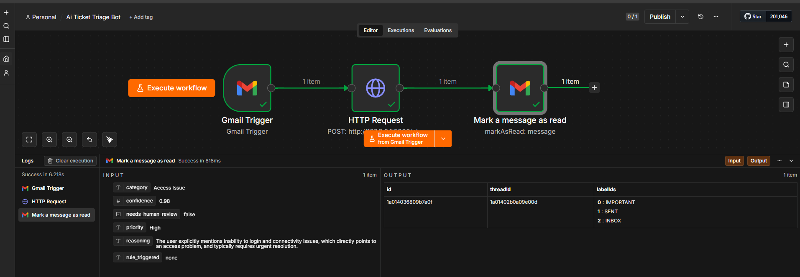

## Automation trigger (n8n)

The workflow: a Gmail Trigger node polls for new unread mail, sends the content to the Flask API, and marks the email as read after a successful classification. This part requires a free self-hosted n8n instance and your own Google Cloud OAuth credentials for Gmail access — see [n8n docs](https://docs.n8n.io) for setup.

## Known limitations / next steps

- LLM self-reported confidence is not well-calibrated; a more robust version would use a self-consistency check (multiple passes) rather than trusting a single confidence score
- Email classification currently uses the Gmail snippet (preview text), not the full message body — fine for short tickets, would need extending for longer ones
- Rate-limit handling is a simple exponential backoff; a production version would use a proper task queue
